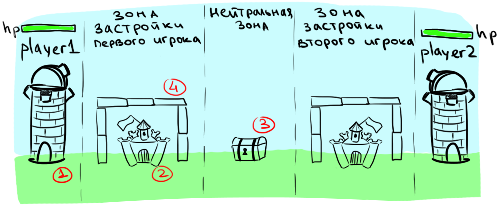

# Get Your Bombs off My Lawn!
Игра под платформу Android для двух игроков. Целью является уничтожение базы противника различным снарядами и защита своей базы путем застройки разрушаемыми блоками. 

**Ключевые особенности:** 
1. Пошаговая стратегическая игра с физикой в реальном времени 
2. Easy to learn, hard to master
3. Гениальная механика со взрывающейся коровой которая интригует абсолютно всех

A two-player game for Android. The goal is the destruction of your opponent's base by bombarding it with various missiles, and the protection of your own base by shielding it with constructions made of destructible blocks.

**Key features:**
1. Turn-based strategy with real-time physics
2. Easy to learn, hard to master
3. The nefariously ingenious exploding cow mechanic that won't leave anyone unmoved

# Инструкция по установке и запуску (для пользователя)
Для установки актуальной версии скачайте приложение в формате apk из прикреплённых файлов к последнему релизу.
При установке Вам потребуется дать разрешение на установку приложений от сторонних (не Play market) источников. Можете смело делать это: наша программа чиста и не содержит вредоносных частей.

# Системные требования
Целевая платформа - Android
Версия Anroid - 10.0 и выше
Минимальная оперативная память - 2 Гб
Минимальное разрешение экрана - 480 х 800

# Сравнение с похожими играми
При создании мы вдохновлялись Angry Birds и Worms, рассмотрим подробнее чем же наш продукт отличается от указанных:
| Продукт (Product)                                         | GYBoML | Angry Birds | Worms         |
|-----------------------------------------------------------|--------|-------------|---------------|
| однопользовательский режим (single-player)                |    -   |      +      | +- (с ботами) |
| многопользовательский режим (multi-player)                |    +   |      -      |       +       |
| наличие внутриигровой экономики (in-game economy)         |    +   |      -      |       -       |
| крутая физика (cool physics)                              |    +   |      +      |       -       |
| вариативность игрового процесса (variativity in gameplay) |    +   |      -      |       +       |


# Инструкция по установке для разработчиков
Для скачивания исходного кода последнего релиза Вам потребуется:
* В терминале (windows: git bash, unix: bash) выполнить команды:

``` bash
	git clone https://github.com/zhenyatos/GYBoML/
```

## Сборка клиентского приложения
* Загрузить по [ссылке](https://developer.android.com/studio) Android Studio
* В Android Studio:
	- Files...
	- Open...
	- Выбрать директорий *client* 
	- Build (Ctrl + F9)
	- Для отладки нажать Shift + F9, для запуска без отладки Shift + F10

## Сборка серверного приложения
### Просмотр и отладка кода
* Загрузить по [ссылке](https://www.jetbrains.com/ru-ru/idea/download/) Intellij Idea
* В Intellij Idea:
	- Files...
	- Open...
	- Выбрать директорий *server*
	- Далее - см. 4 и 5 пункты инструкции по сборке клиентского приложения

Наибольший интерес представляет запуск сервера с подключением к нему нескольких клиентов. Для этого требуется собрать JAR-файл и запустить несколько instance'ов:

### Сборка JAR-файлов для сетевого клиента и сервера

* Установить утилиту [maven](https://maven.apache.org/download.cgi) для своей операционной системы
* Добавить в переменную окружения *PATH* адрес директория *apache_<version>/bin*
* Убедиться, что существует переменная окружения *JAVA_HOME*, указывающая на адрес JDK не старше 8
* Перейти в корень проекта
* Вызывать команду mvn package
* Запуск сетевого клиента:
	- Перейти в директорий net-client/target
	- Вызвать команду:
		```bash
		java -jar ???_WithDependencies.jar
		```
	(имя архива указывается примерно, оно меняется от версии к версии)
* Запуск сервера:
	- Перейти в директорий server/target
	- Далее аналогично сетевому клиенту

Для подключения к серверу клиент должен послать запрос req. При этом в stdout сервер отобразит информацию о подключении клиента

Для передачи хода клиенту необходимо написать команду:
```bash
pass
```

Для отключения клиента и сервера необходимо написать в консоль:
```bash
q
```

Актуальная версия кода лежит в ветке develop. Тем не менее, будьте осторожны: некоторые фичи могут быть нестабильными

# Git workflow
[Статья atlassian](https://www.atlassian.com/git/tutorials/comparing-workflows/gitflow-workflow) и [статья на хабре](https://habr.com/ru/post/106912/)

В репозитории есть две основные ветки - **origin/master** и **origin/develop**. Сливать с ветвями напрямую нельзя. Необходимо сделать pull request, который будет разрешать техлид. Также присутствуют ветви, соответствующие задаче, в них реализуемой.

Ветка **origin/develop** является главной веткой разработки. Она всегда содержит собирающийся без ошибок код.
По окончании очередного спринта ветвь **origin/develop** при достаточной стабильности сливается в **origin/master**, образуя новый "*релиз*".

Каждая новая функциональность является соответствующей задачей (или *issue*) на ZenHub (или любой другой agile платформе) и имеет свое *название*, вкратце описывающее суть задачи. Для реализации соотвествующей функциональности надо создать новую ветку на базе ветки **origin/develop** в формате: **{номер задачи}-{название задачи}**. Это нужно для того, чтобы по ветке можно было легко найти задачу, которую реализует эта ветка, на agile платформе.

При успешной реализации функциональности соответствующая ей ветвь сливается обратно в develop, **предварительно делая git rebase**, если это необходимо (а именно - когда за время разработки этой функциональности произошли коммиты в **origin/develop** и нужно перебазировать текущую ветку для успешного слияния без конфликтов).

## Сообщения к коммитам:
Читайте https://m.habr.com/ru/post/416887/

1) Отделять заголовок от тела пустой строкой.
2) Ограничивать заголовок 50 символами.
3) Писать заголовок с заглавной буквы.
4) Не ставить точку в конце заголовка.
5) Использовать повелительное наклонение в заголовке.
6) Переходить на новую строку в теле на 72 символах.
7) В теле отвечать на вопросы: "Что?" и "Почему?", а не "Как?".

## Замечания:
1) Один коммит должен содержать одно целостное осмысленное добавление новой функциональности. Не надо делать несколько коммитов в 
ветке, реализуя некоторую функциональность (по типу 'Updated a.cpp' -> 'Updated b.cpp' -> 'Updated README.txt'). Обычно, одна ветка функциональности - это один коммит. Для "сплющивания" нескольких **последовательных**(!) коммитов в один используется 
git rebase -i COMMIT_SHA, где COMMIT_SHA - хэш коммита, идущего **перед первым** в серии сплющиваемых коммитов.
Если не понятно - подробнее [тут](https://htmlacademy.ru/blog/useful/git/how-to-squash-commits-and-why-it-is-needed)

## Стандарт кодирования
- Классы именуем по принципу: **каждое слово** с заглавной буквы:
	* class MainActivity
	* class BaseWeapon
- Последнее слово в имени класса обозначает категорию объектов, к которым он относится:
	* class MainActivity
	* class FirstLevel
	* class WoodDefense
- Функции и переменные именуем в camel-case:
	* Object getYourBombsOffMyLawn()
	* void setWeaponToViking(Gamer viking)
	* int bombsCount
- Аргументы функций при написании реализаций и при вызове не отделяем пробелами:
	* int getGamersCount(Forest f)
	* int gamersCount = getGamersCount(forest)
- Все вложенные по смыслу инструкции смещаем относительно родительских на четыре пробела (во всех IDEA-подобных IDE по умолчанию осуществляется нажатием Tab):
```java
for (int i = 0; i < 10; i++) {
	a[i] += i;
	if (a[i] == 0) {
	    a[i] = -1;
	    break;
	}
}
```
- Фигурные скобки для формирования блоков команд ставятся *всюду одинаково*: левая скобка на одной строке с инициатором блока (шапкой функции, условным оператором, циклом), правая скобка - на следующей строке после последней команды блока:
```java
Status foo(Object bar) {
	if (bar == null) {
		b = new Object(...);
		b.value = 0;
	}
}
```
- Все флаги оформляем в enum заглавными буквами:
```java
enum Status {
	OK(0),
	BAD(1);
	...
}
```
- *Общие правила*: все переменные должны именоваться так, чтобы по названию угадывалась их семантика. Не должно быть объектов с абстрактными многозначными *в контексте программы* именами.
	*Пример как не надо делать*:
```java
void printTwoWeirdNumbers(int[] array) {
	int cnt1 = 0, cnt2  = 0;
	for (int i = 0; i < array.length; i++)
		if (array[i] % 2 == 0)
			cnt1++;
		else
			cnt2++;
	System.out.println(...); // печатаем количества
}
```
*Вот так оптимально*:	
```java
void printEvenOddCount(int[] array) {
	int evenCount = 0, oddCount = 0;
	for (int i = 0; i < array.length; i++)
		if (array[i] % 2 == 0)
			evenCount++;
		else
			oddCount++;
	System.out.println(...); // печатаем количества
}
```

# Участники проекта 
* [Самутичев Евгений](https://github.com/zhenyatos) - тимлид
* [Дамаскинский Константин](https://github.com/kystyn) - техлид
* [Варисов Арсен](https://github.com/Jiija) 
* [Петрунин Григорий](https://github.com/via8) 
* [Соломатин Макар](https://github.com/MakarSolomatin)
